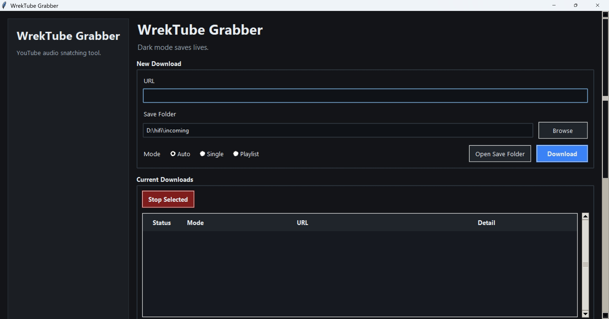

# WrekTubeGrabber

Local Windows GUI app for downloading audio from YouTube using yt-dlp.

## Screenshot



## Purpose

Built to replace manual command-line yt-dlp use with a simple GUI for normal humans.

## Features

- Paste URL and hit Enter
- Single mode downloads
- Playlist mode downloads
- Save folder picker
- Background downloads
- Current download status
- Download history
- Remembers selected save folder

## Requirements

### Install Before Running

- **Python 3.x**
- **yt-dlp**
- **ffmpeg**

## Run

```cmd
py yt_dlp_gui_downloader.py